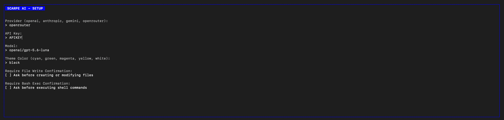
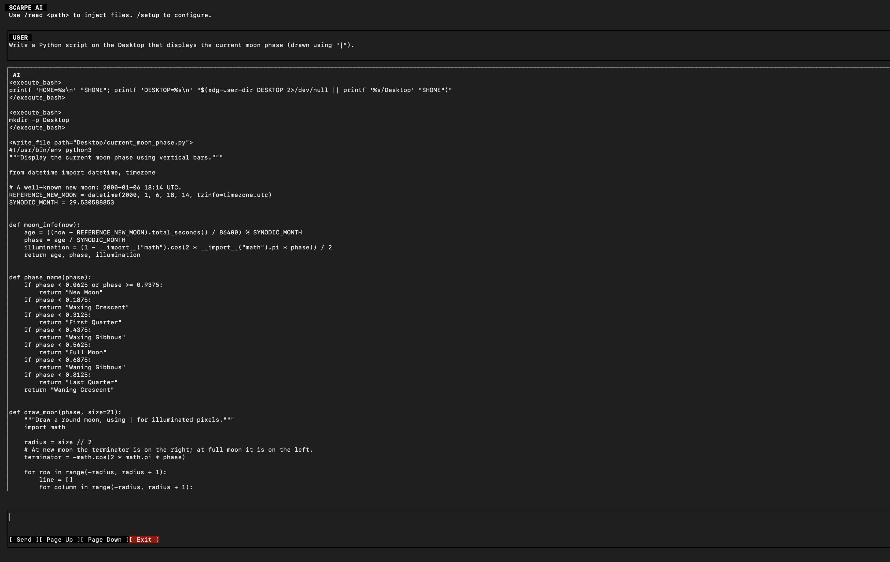
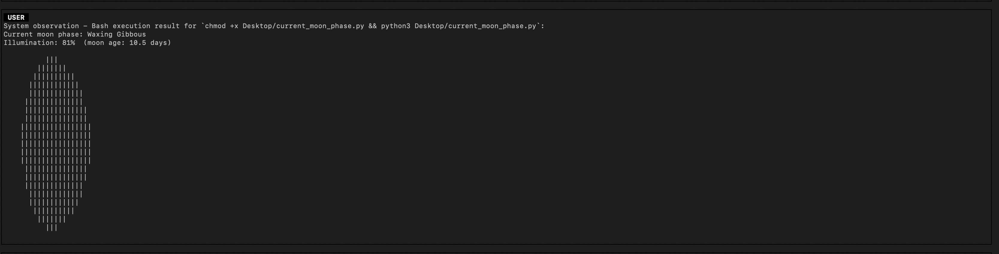

# Final Report — Scarpe TUI

## Project Overview

**Project:** Scarpe TUI  
**Repository:** [TureCatedu/GSoc-2026](https://github.com/TureCatedu/GSoc-2026)  
**Implementation:** Ruby and Rust  
**Interface:** Terminal User Interface (TUI)  
**License:** MIT for the Scarpe TUI component

Scarpe TUI is a terminal-based user-interface toolkit and AI assistant. It combines a Ruby DSL inspired by Shoes with a Rust terminal-rendering and event-processing core. The project provides a declarative way to build terminal applications while using Rust for layout, rendering, keyboard input, mouse input, editing, scrolling, and terminal lifecycle management.

During the project, I developed the core TUI functionality, connected Ruby and Rust through FFI, implemented interactive widgets and scrolling, improved terminal rendering and text editing, added safety controls to the AI application, created a portable CLI bundling workflow, and documented and tested the resulting system.

---

## Goals

The main goals of the project were to:

1. Build a functional terminal UI framework with a Ruby-facing API.
2. Implement a Rust backend capable of rendering a virtual UI tree efficiently.
3. Connect the Ruby and Rust layers through a stable C-compatible FFI interface.
4. Support interactive controls such as text editors, buttons, checkboxes, and scrollable views.
5. Provide keyboard and mouse event handling.
6. Create a practical terminal AI assistant using the framework.
7. Add safeguards around file-system and shell-command operations.
8. Support persistent configuration and conversation history.
9. Produce a distributable, self-contained CLI executable.
10. Add documentation and automated tests for the core functionality and security contracts.

---

## Repository and Development History

The repository history reflects an incremental implementation and consolidation process. The work progressed from establishing the Ruby/Rust integration to implementing the UI primitives, improving the Rust rendering engine, adding editing and scrolling behavior, integrating the AI application, and preparing the project for distribution.

The main development stages were:

- Establishing the Rust `cdylib` project and C ABI.
- Creating Ruby FFI bindings and the initial Ruby DSL.
- Implementing the virtual DOM and recursive layout system.
- Adding terminal rendering with double buffering and incremental updates.
- Adding interactive widgets and event handling.
- Improving Unicode text editing and cursor movement.
- Implementing scroll areas, mouse-wheel scrolling, page navigation, and scrollbars.
- Adding setup preferences and persistence.
- Adding file-read, file-write, and shell-command capabilities to the AI application.
- Introducing workspace restrictions and private-file handling.
- Adding automated contract tests and bundle verification.
- Consolidating the documentation and release workflow.

The current source tree and documentation represent the result of these stages. The translated roadmap in `docs/roadmap.md` records the completed work, the current distribution phase, and the remaining improvements.

---

## Architecture

The project is divided into several layers.

### Ruby Application Layer

`examples/app.rb` contains the Scarpe AI application. It is responsible for:

- Loading and validating configuration.
- Showing the setup screen.
- Managing provider and model settings.
- Loading and saving conversation history.
- Handling `/read`, `/clear`, `/setup`, and `/config`.
- Sending requests to supported AI providers.
- Streaming provider responses.
- Displaying user and assistant messages.
- Processing file-write and shell-command tool requests.
- Requesting consent before potentially destructive actions.

### Ruby TUI DSL

`lib/scarpe_tui.rb` defines the Ruby interface used to build applications. It exposes methods such as:

- `stack`
- `flow`
- `border`
- `scroll_area`
- `dock_bottom`
- `para`
- `edit_line`
- `edit_box`
- `button`
- `checkbox`
- `append_to`

The DSL maintains a node stack while evaluating nested blocks. This allows UI trees to be described declaratively. Interactive controls register Ruby callbacks, which are invoked after the Rust layer reports a submission or click.

The DSL also provides wrapper objects for dynamic state access:

- `EditLine`
- `EditBox`
- `Checkbox`
- `TextNode`

These wrappers allow Ruby code to read or update widget state while the application is running.

### FFI Layer

`ext/mylib.rb` loads the compiled Rust library and declares the native functions used by Ruby. The interface includes functions for:

- Initializing and freeing the TUI context.
- Creating and linking nodes.
- Applying styles.
- Updating and reading node text.
- Reading and setting checkbox state.
- Polling terminal events.
- Rendering frames.
- Retrieving clicked controls.
- Moving scroll areas to the beginning or end.

The C declarations are documented in `header/scarpe_tui.h`. The Rust functions use `extern "C"` and return status codes so that Ruby can translate native errors into typed exceptions:

- `RustPanicError`
- `RustIOError`
- `RustNullPointerError`
- `RustInvalidIdError`

### Rust Core

The Rust implementation is contained in `rust_core/`. It is built as both an `rlib` and a `cdylib`.

The core stores the interface as a virtual DOM. Each node has:

- A node type.
- A node identifier.
- Child node identifiers.
- A computed layout.
- A style.
- An optional text editor.

Supported node types include:

- Root
- Stack
- Flow
- Text
- Edit line
- Edit box
- Button
- Checkbox
- Border
- Dock bottom
- Scroll area

`context.rs` manages:

- Terminal initialization and shutdown.
- Layout computation.
- Buffer rendering.
- Mouse hit testing.
- Scroll handling.
- Cursor positioning.
- Clipping.
- Scrollbar rendering.

`ffi.rs` exposes the C ABI and translates terminal events and Rust operations into status codes that can be consumed safely by Ruby.

---

## Terminal Rendering

The Rust core uses two terminal buffers:

- `current_buffer`
- `next_buffer`

For each redraw:

1. The terminal dimensions are read.
2. Buffers are resized when necessary.
3. The next buffer is reset.
4. Layouts are recalculated.
5. The virtual DOM is drawn into the next buffer.
6. Scroll areas clip their children.
7. Scrollbars are drawn over the clipped content.
8. Changed cells are compared with the current buffer.
9. Only changed cells are written to the terminal.
10. The buffers are swapped.

This diff-rendering approach avoids redrawing every terminal cell on every frame. It reduces unnecessary terminal output and provides a smoother interface during streaming AI responses and text editing.

The rendering system also supports:

- Foreground and background ANSI colors.
- Text modifiers such as bold, underline, italic, and reverse.
- Box-drawing borders.
- Button labels.
- Native checkbox indicators.
- Unicode spinner characters.
- A visible cursor for focused editors.

---

## Layout System

The layout engine computes positions and dimensions recursively.

### Stack

A stack places children vertically, one after another.

### Flow

A flow places children horizontally and wraps them when they exceed the available width.

### Border

A border adds one cell of space around its contents and renders a box using terminal box-drawing characters.

### Dock Bottom

A dock-bottom container is positioned at the bottom of the terminal. It is used by the AI application for the input area and action buttons.

### Scroll Area

A scroll area provides a viewport for content that is taller than the available space. Its children are laid out normally, but rendering and mouse interaction are clipped to the viewport.

A `max_height` of `0` allows the scroll area to fill the available space between the current position and the bottom dock. This is used for the chat history.

The layout system also clamps scrolling to the available content, preventing the view from moving beyond the beginning or end.

---

## Text Editing

The text editor implementation is in `rust_core/src/editing.rs`.

The editor stores:

- The text as a UTF-8 string.
- The cursor as a byte offset that remains on a valid character boundary.

Implemented operations include:

- Character insertion.
- Backspace.
- Left and right movement.
- Home and end movement within a line.
- Up and down movement between lines.
- Newline insertion.
- Unicode-aware cursor movement.

The implementation handles multi-byte characters correctly. Tests cover characters such as the euro sign and verify that cursor movement and deletion do not split UTF-8 sequences.

`EditLine` is intended for single-line input, while `EditBox` supports multi-line text. `Shift+Enter` inserts a newline in an edit box. Fallback support also accepts terminal combinations reported as `Alt+Enter` or `Ctrl+Enter`.

---

## Input and Interaction

The Rust event thread reads crossterm events and places them into a channel. The Ruby application periodically calls `scarpe_tui_poll_events`, which drains and processes the pending events.

Supported interaction includes:

- `Esc` to quit.
- `Ctrl+C` to quit.
- `Tab` to switch between text inputs.
- Arrow keys for editing or scrolling.
- `Page Up` to move toward the beginning of a scrollable view.
- `Page Down` to move toward the end.
- Mouse clicks on buttons.
- Mouse clicks on checkboxes.
- Mouse clicks to focus editors.
- Mouse-wheel scrolling.
- Terminal resize events.

The Rust core reports button and editor submissions to Ruby. Ruby then dispatches the corresponding callback registered by the DSL.

---

## Scrolling Improvements

Scrolling was implemented and expanded throughout the project.

The completed scrolling functionality includes:

- `Up` and `Down` navigation when no text editor is focused.
- Mouse-wheel scrolling.
- `Page Up`.
- `Page Down`.
- Programmatic `scroll_to_start`.
- Programmatic `scroll_to_end`.
- Clamping to valid scroll offsets.
- Automatic initial positioning at the bottom of the chat.
- Following the bottom when new chat messages are appended.
- Preserving the user's position when they have manually scrolled upward.
- Clipping content inside the scroll viewport.
- A visible vertical track and thumb.

The scrollbar calculates its thumb size based on the relationship between the viewport and the total descendant content height. This allows nested containers, borders, and wrapped messages to contribute correctly to the scrollbar calculation.

---

## Scarpe AI Application

The application in `examples/app.rb` demonstrates the TUI framework in a practical terminal assistant.

### Supported Providers

The application supports:

- OpenAI
- Anthropic
- Google Gemini
- OpenRouter

Each provider uses its own request format and streaming response format. The application normalizes the streamed content into the chat interface.

### Streaming

AI responses are streamed token by token. While waiting for the first token, the interface displays an animated spinner. As content arrives, the current assistant message is updated dynamically in the TUI.

The stream parser maintains a partial-line buffer so that SSE messages split across network chunks can be processed correctly.

### Conversation History

Conversation history is stored in:

`~/.scarpe_ai_history.json`

The application:

- Loads history on startup.
- Ensures that the system prompt is present.
- Saves user and assistant messages.
- Limits provider context to the most recent messages.
- Records system observations for shell-command results.

### File Injection

The `/read <path>` command can inject:

- A single file.
- A complete directory tree.

Directory reading excludes common generated or dependency directories, including:

- `.git`
- `node_modules`
- `target`
- `build`
- `vendor`
- `dist`
- `.next`
- `.idea`

Files larger than 150 KB are skipped. Binary files are detected and excluded, while readable text is included with file markers.

---

## Security and Consent Controls

The AI application can create or modify files and execute shell commands. These operations are protected by several controls.

### Workspace Restriction

AI-provided file paths are resolved with `safe_workspace_path`. The function ensures that a requested path remains within the current workspace. Absolute paths and traversal attempts outside the workspace are rejected.

This prevents an AI response from writing arbitrary files elsewhere on the system.

### Private File Permissions

Configuration and history files are written with restrictive permissions:

`0600`

The application also applies these permissions after writing. This protects API keys and conversation history from other local users.

### Controlled Command Environment

Shell commands are executed with a restricted environment containing only the required values:

- `PATH`
- `HOME`
- `LANG`

`unsetenv_others: true` prevents unrelated environment variables, including accidental API-key exports, from being inherited by child processes.

### Consent Preferences

The setup screen provides native checkboxes for:

- File-write confirmation.
- Bash-execution confirmation.

Both preferences default to enabled when missing and are persisted as booleans in:

`~/.scarpe_ai_config.json`

When consent is enabled, the user can explicitly allow or reject each requested operation. When consent is disabled, the operation is performed automatically according to the application's configured behavior.

### Tool Protocol

The system prompt instructs the AI to use only the following XML tool formats:

- `<write_file path="...">...

## Application Demonstration

The following screenshots demonstrate the application in use, from its initial configuration to an AI-assisted development task. Together, they show how the interface guides the user through setup and then supports an interactive conversation with the AI.

### Getting started with the setup page

The setup page is the first point of interaction with the application. It brings the main configuration options together in one place, allowing the user to prepare the AI provider and review the available consent settings before starting a session. This provides a clear and approachable entry point while giving the user control over how the application operates.

### Exploring an AI-assisted task in the chat page

The chat page demonstrates the application’s central workflow: communicating with the AI through the interface to work on a practical programming task. In this example, the user asks the AI to implement a Python file for viewing the moon phase. The screenshot illustrates how the application can be used not only for conversation, but also for guiding and supporting concrete development work.

