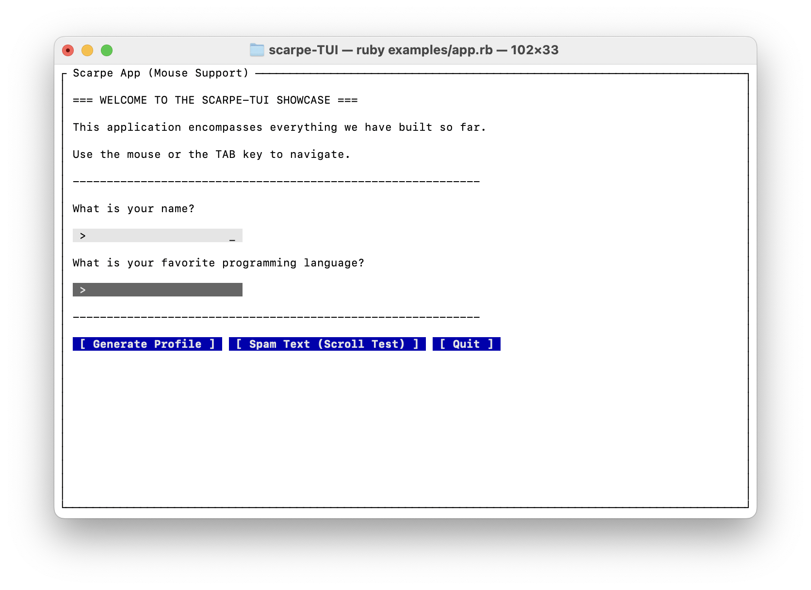
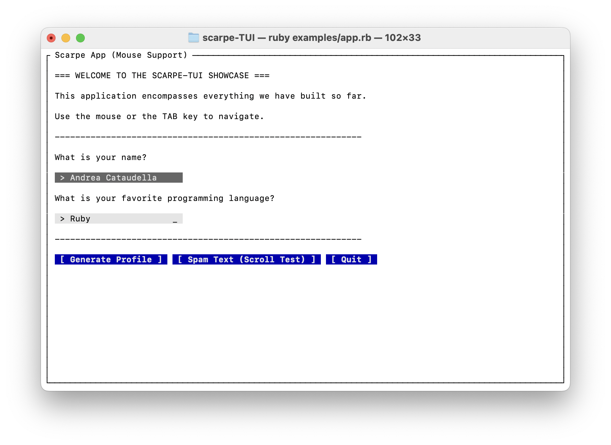
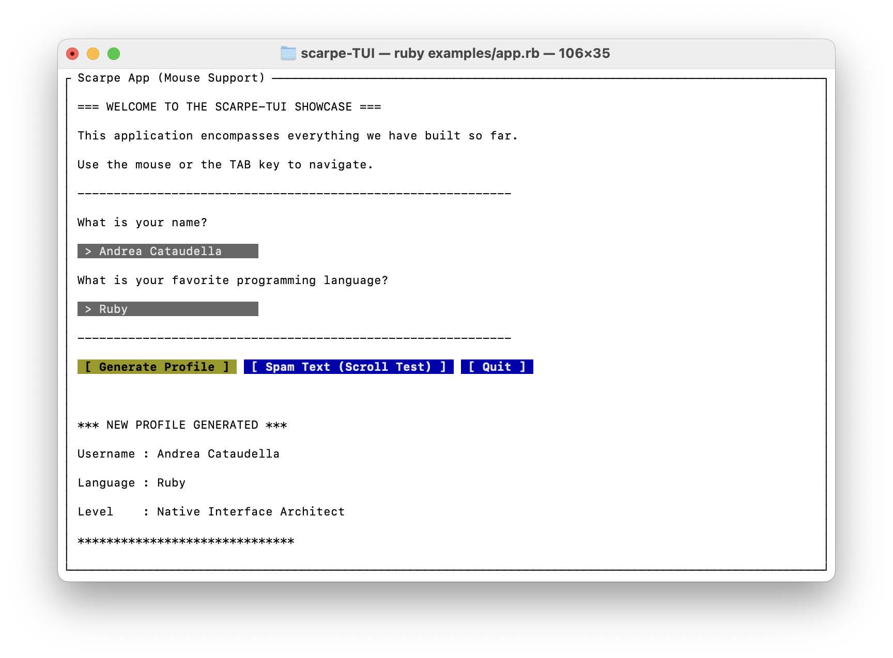
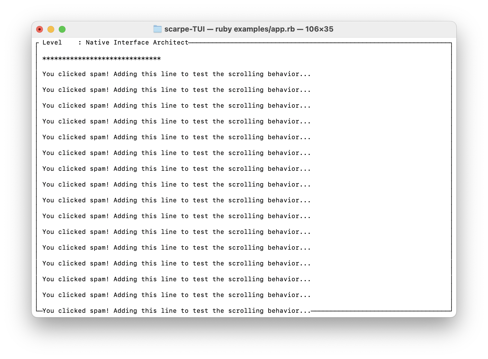

# 🚀 Scarpe-TUI Showcase Demo

## 📖 Overview
Welcome to the interactive showcase of the **Scarpe-TUI** library! This demo acts as a comprehensive Proof of Concept (PoC) demonstrating how a declarative Ruby GUI DSL (Shoes) can be seamlessly ported to the terminal environment. 

The demo features a clean Text User Interface (TUI) where users can interact with text inputs, navigate using the keyboard (`TAB`) or mouse, and trigger dynamic interface updates via buttons. It proves the viability of bridging Ruby and a custom high-performance Rust rendering engine via C-FFI.

---

## ⚙️ How the Demo Works
The application simulates a simple "Profile Generator". Here is the basic user flow:
1. **Navigation:** The user can navigate between the input fields using the `TAB` key or by clicking directly on them with the mouse. The active field is highlighted.
2. **Text Input:** The user types their name and favorite programming language into the respective fields. The Rust engine handles all keystrokes and backspaces natively.
3. **Generate Profile:** Upon clicking the `[ Generate Profile ]` button, the application reads the data from the input fields, processes it, and dynamically injects new text elements into the terminal to display the result.
4. **Scroll Testing:** Clicking the `[ Spam Text (Scroll Test) ]` button continuously adds new lines of text to the interface. Once the text exceeds the terminal's physical height, the user can use the mouse scroll wheel to navigate the overflowing content.

---

## 💻 Step-by-Step Code & UI Walkthrough

### 1. Initialization and Layouts


When the application starts, it evaluates the Ruby DSL. The UI is built using `stack` (for vertical arrangement of the welcome text and inputs) and `flow` (for the horizontal arrangement of the buttons at the bottom). The custom Rust engine calculates the bounding boxes and draws the interface inside a bordered terminal window. At this stage, the input fields (`> _`) are empty and waiting for user interaction.

### 2. Interactive Input & Focus Management


As you interact with the application, the Rust event loop manages focus and hardware events. In this screenshot, the user has clicked on the first input field (which highlights in white to indicate active focus) and typed "Andrea Cataudella". The user then moved focus to the second field. All of this state management happens in Rust's memory without blocking the Ruby Virtual Machine.

### 3. Callbacks and Bidirectional Data Flow


Clicking the **[ Generate Profile ]** button triggers a complex interaction across the FFI boundary. Rust captures the mouse click, maps it to the button's ID, and sends it to Ruby. The Ruby callback then requests the text values from the input buffers in Rust, checks the logic, and dynamically pushes new UI nodes (`para`) to display the user's profile. The layout engine instantly recalculates the grid to display the new text at the bottom.

### 4. Dynamic Rendering and Viewport Clipping


To test the robustness of the rendering engine, clicking **[ Spam Text (Scroll Test) ]** repeatedly adds new lines to the DOM. Once the content overflows the terminal height, the custom Rust engine applies strict viewport clipping to prevent `out-of-bounds` segmentation faults. You can then fluidly scroll through the text using the mouse wheel, demonstrating the effectiveness of the double-buffering architecture.

---

## 🛠️ Execution Instructions

To run this demo locally on your machine, follow these steps:

1. **Build the Rust Engine:**
   Navigate to the `rust_core` directory and build the dynamic library.
   ```bash
   cd rust_core
   cargo build
   cd ..

2. **Install Dependencies:**
   bundle install

4. **Run the Application:**
   bundle exec ruby examples/app.rb
   
(Note: To exit the application, simply click the [ Quit ] button or press ESC/q).
   
